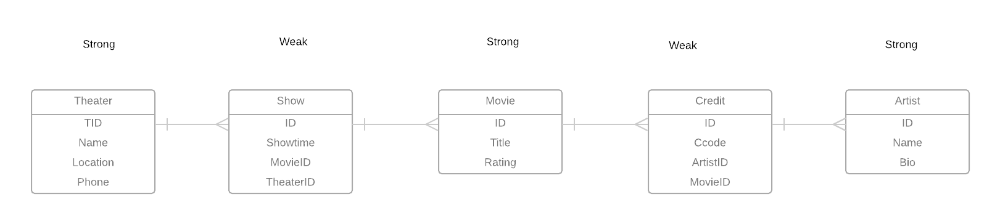

# Data Modeling Notes
#Normalization Analysis

  #1NF Conversion
  Tname --> Location, Phone
  MTitle --> Rating
  MTitle --> Ccode, Cname
  T,name, SHowtime --> MTitle
  Theaters(ID, Location, Phone)
  Movies(MID, MTitle, Rating)

  #2NF Conversion
  #3NF Conversion
    determinant columns --> dependent columns
  #BCNF Conversion
    determinant columns --> dependent columns
#Entity Relationship Model

